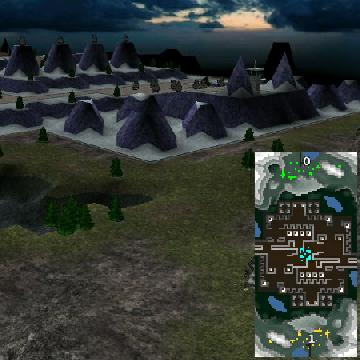
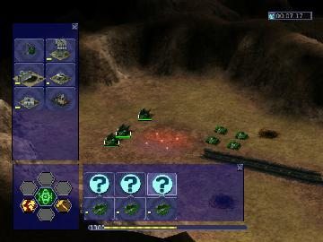
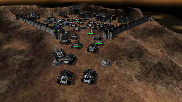

> [!TIP]
> **If you want maps or mods for the latest version of Warzone 2100, please visit:**
> - **[The Warzone 2100 Maps Database](https://maps.wz2100.net)**

----------------------------------

# Archived Old Addons

> [!WARNING]
> This is a listing of archived old maps / mods built for old versions of Warzone 2100.

- [Archived Maps](#maps)
- [Archived Map-Mods](#map-mods)
- [Archived Mods](#mods)

## Maps:

> [!IMPORTANT]
> The following maps are in old map formats intended for old versions of WZ.  
> **Updated versions of maps are available in the Warzone 2100 Maps Database.**

View 227 archived old maps

[Page 1](/oldmaps-1.md) | [Page 2](/oldmaps-2.md) | [Page 3](/oldmaps-3.md)

## Map-Mods:

> [!CAUTION]
> The following are archived old map-mods that were designed for older versions of Warzone 2100. **They are unlikely to work properly with modern releases.**

| Preview | Title | Players | Game Version | Author | Created |
| ------- | ----- | ------- | ------------ | ------ | ------- |
|  | [FabMountainSquare](/assets/17/) | 10 | 3.1.0 | Fabio_IT | 2013-3-28 |
|  | [Mansion](/assets/24/) | 4 | 3.1.0 | NoQ | 2013-4-1 |
|  | [The Paradigm](/assets/27/) | 4 | 3.1.0 | NoQ | 2013-3-22 |
|  | [Mirage](/assets/31/) | 6 | 3.1.0 | NoQ | 2013-3-22 |
|  | [Inversion](/assets/32/) | 4 | 3.1.0 | NoQ | 2013-4-1 |
|  | [Academy](/assets/33/) | 4 | 3.1.0 | NoQ | 2013-3-23 |
|  | [FabMountainSquare](/assets/69/) | 6 | 3.1.0 | Fabio_IT | 2013-3-28 |
|  | [FabCrazyScavs](/assets/70/) | 10 | 3.1.0 | Fabio_IT | 2013-3-28 |
|  | [Palace](/assets/117/) | 6 | 3.1.0 | NoQ | 2013-4-7 |
|  | [Anchor](/assets/126/) | 5 | 3.1.0 | NoQ | 2013-4-13 |
|  | [Marble](/assets/166/) | 2 | 3.1.0 | NoQ | 2013-4-27 |
|  | [Starfish](/assets/209/) | 5 | 3.1.0 | NoQ | 2013-6-2 |

## Mods:

> [!CAUTION]
> The following are archived old mods that were designed for older versions of Warzone 2100. **They should not be used with modern releases.**

> [!TIP]
> Many of these mods are now integrated into the game or available as built-in options.

| Preview | Title | Player Mode | Mod Category | Game Version | Author | Created |
| ------- | ----- | ----------- | ------------ | ------------ | ------ | ------- |
|  | [Volcanic Tileset](/assets/28/) | Skrimish/MP | Graphics | 3.1.0 | NoQ | 2013-3-23 |
|  | [Paradise Tileset](/assets/29/) | Skrimish/MP | Graphics | 3.1.0 | NoQ | 2013-4-6 |
|  | [Glacier Tileset](/assets/30/) | Both | Graphics | 3.1.0 | NoQ | 2013-11-20 |
|  | [Ultimate Scavenger AI](/assets/148/) | Skrimish/MP | AI | 3.1.1 | NoQ | 2014-9-27 |
|  | [WZ Mini: Scavenger Wars](/assets/149/) | Skrimish/MP | Stats (Balance) | 3.1.0 | NoQ | 2013-4-23 |
|  | [NullBot: Extra personalities](/assets/174/) | Skrimish/MP | AI | 3.1.2 | NoQ | 2016-1-7 |
|  | [Derrick](/assets/179/) | Both | Graphics | 3.1.0 | Berg | 2013-5-5 |
|  | [cyborg factory](/assets/180/) | Both | Graphics | 3.1.0 | Berg | 2013-5-5 |
|  | [Advanced HQ](/assets/181/) | Both | Graphics | 3.1.0 | Berg | 2013-5-9 |
|  | [Propulsion](/assets/198/) | Both | Graphics | 3.1.0 | Berg | 2013-5-21 |
|  | [MechBorg by xanax](/assets/223/) | Both | Graphics | 3.1.0 | Berg | 2013-12-10 |
|  | [Helicopters](/assets/228/) | Both | Graphics | 3.1.0 | Jorzi | 2013-8-27 |
|  | [Campaign Time Limit mod](/assets/238/) | Campaign | Other | 3.1.0 | NoQ | 2013-11-3 |
|  | [Vtol pad](/assets/252/) | Both | Graphics | 3.1.0 | Berg | 2013-12-14 |
|  | [Contingency (Beta)](/assets/258/) | Skrimish/MP | Stats (Balance) | 3.1.1 | Shadow Wolf TJC | 2014-1-21 |
|  | [NoArty](/assets/264/) | Skrimish/MP | Other | 3.1.1 | Perseus | 2015-11-22 |
|  | [BP's Rebalance Mod](/assets/280/) | Skrimish/MP | Stats (Balance) | 3.1.2 | Black Project | 2015-1-4 |
|  | [Art Revolution mod beta](/assets/292/) | Both | Graphics | 3.3.0 | Jorzi | 2019-3-4 |
|  | [BoneCrusher!](/assets/294/) | Skrimish/MP | AI | 3.1.5 | Prot | 2017-2-5 |
|  | [YAGeSM - Yet Another Generic Stats Mod v2 (3.2 Release Version)](/assets/296/) | Skrimish/MP | Stats (Balance) | 3.2.0 | Black Project | 2016-7-23 |
|  | [BP's Expanded Structure Limits - 3.2 Release](/assets/297/) | Skrimish/MP | Other | 3.2.0 | Black Project | 2016-7-17 |
|  | [YAGeSM - Yet Another Generic Stats Mod v2 (3.1 Release Version)](/assets/298/) | Skrimish/MP | Stats (Balance) | 3.1.5 | Black Project | 2016-7-23 |
|  | [Enhanced Balance for 3.2](/assets/299/) | Skrimish/MP | Stats (Balance) | 3.2.1 | MIH-XTC | 2016-8-29 |
|  | [Cobra AI](/assets/306/) | Skrimish/MP | AI | 3.2.3 | Berserk Cyborg | 2017-5-15 |
