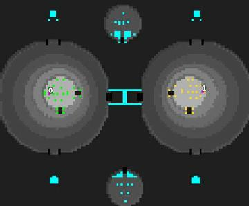

> **ARCHIVED**: This is an archive of an old map / mod from the old Addons site.

### [Map]

> [!IMPORTANT]
> This is an old map format. **Updated versions of maps are available in the Warzone 2100 Maps Database.**

# Battlehills

| | |
| - | - |
| __Author:__ | ayct |
| Addon-type: | __Map__ |
| __Game Version:__ | 3.1.0 |
| Created: | March 18, 2013, 1:29 a.m. |
| Oil: | Medium |
| Players: | 2 |
| Bases: | Normal bases |
| __License:__ | CC-BY-3.0 OR GPL-2.0-or-later |

> File: [2cBattle_hills_v2.wz](https://github.com/Warzone2100/old-addons-site/raw/main/assets/1/2cBattle_hills_v2.wz)  
> SHA256: 4624584eab8912558c80aba7c68b21e02530b9971b522978b85d8c4660a995ba

## Description:

2-player rush symmetrick map.

Very simple, very quick battle.

