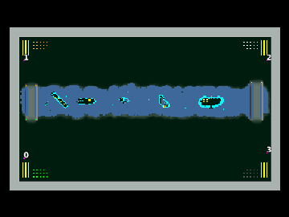

> **ARCHIVED**: This is an archive of an old map / mod from the old Addons site.

### [Map]

> [!IMPORTANT]
> This is an old map format. **Updated versions of maps are available in the Warzone 2100 Maps Database.**

# Waste-stream

| | |
| - | - |
| __Author:__ | Virus- A |
| Addon-type: | __Map__ |
| __Game Version:__ | 3.1.0 |
| Created: | April 1, 2013, 3:25 a.m. |
| Oil: | Extreme |
| Players: | 4 |
| Bases: | Advanced Bases |
| __License:__ | CC0-1.0 |

> File: [4cWastestream.wz](https://github.com/Warzone2100/old-addons-site/raw/main/assets/103/4cWastestream.wz)  
> SHA256: b696cae79426d8efa15397529360e5a96bdd9bd4a1b4f5f20e4e4ef33e2cb1e3

## Description:

4 players

Extra Extreme oil Advanced bases has 14 power

generators 56 oil per base

Scav - on

enjoy

