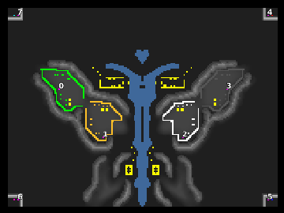

> **ARCHIVED**: This is an archive of an old map / mod from the old Addons site.

### [Map]

> [!IMPORTANT]
> This is an old map format. **Updated versions of maps are available in the Warzone 2100 Maps Database.**

# butterfly

| | |
| - | - |
| __Author:__ | Virus- A |
| Addon-type: | __Map__ |
| __Game Version:__ | 3.1.0 |
| Created: | April 1, 2013, 11:57 p.m. |
| Oil: | Medium |
| Players: | 8 |
| Bases: | Advanced Bases |
| __License:__ | CC0-1.0 |

> File: [8cbutterfly.wz](https://github.com/Warzone2100/old-addons-site/raw/main/assets/105/8cbutterfly.wz)  
> SHA256: 30d4d824b14de329bd6d0fff0cee700b20ef9cabde6567155c03298b4b9cf45b

## Description:

8 players

4 players in battle

4 viewers

low power

8 holes

4 factories

research centers 2

enjoy

