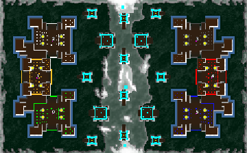

> **ARCHIVED**: This is an archive of an old map / mod from the old Addons site.

### [Map]

> [!IMPORTANT]
> This is an old map format. **Updated versions of maps are available in the Warzone 2100 Maps Database.**

# DA-towers

| | |
| - | - |
| __Author:__ | duda |
| Addon-type: | __Map__ |
| __Game Version:__ | 3.1.0 |
| Created: | April 2, 2013, 11:20 p.m. |
| Oil: | High |
| Players: | 6 |
| Bases: | Advanced Bases |
| __License:__ | CC0-1.0 |

> File: [6cDAtowersv2.wz](https://github.com/Warzone2100/old-addons-site/raw/main/assets/108/6cDAtowersv2.wz)  
> SHA256: cf44ef780b6215f899953ff42a012fa6fb6005a7cd0328dadc74e00110449de6

## Description:

3 vs 3

16 oil per base + from scavengers

