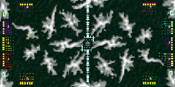

> **ARCHIVED**: This is an archive of an old map / mod from the old Addons site.

### [Map]

> [!IMPORTANT]
> This is an old map format. **Updated versions of maps are available in the Warzone 2100 Maps Database.**

# DA-mt-ray

| | |
| - | - |
| __Author:__ | duda |
| Addon-type: | __Map__ |
| __Game Version:__ | 3.1.0 |
| Created: | April 3, 2013, 5:04 a.m. |
| Oil: | Extreme |
| Players: | 10 |
| Bases: | Normal bases |
| __License:__ | CC0-1.0 |

> File: [10cDAmtrayv2.wz](https://github.com/Warzone2100/old-addons-site/raw/main/assets/113/10cDAmtrayv2.wz)  
> SHA256: 90c5d5bee827dc6695fec1808b1ba0ccb03a7b15c6495c354b41bd00bec6b2ed

## Description:

5 vs 5

24 oil/base + from scavengers

