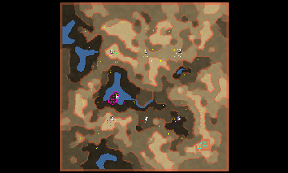

> **ARCHIVED**: This is an archive of an old map / mod from the old Addons site.

### [Map]

> [!IMPORTANT]
> This is an old map format. **Updated versions of maps are available in the Warzone 2100 Maps Database.**

# JCDG_Nowhere

| | |
| - | - |
| __Author:__ | Amiral JCDG |
| Addon-type: | __Map__ |
| __Game Version:__ | 3.1.0 |
| Created: | April 6, 2013, 1:43 p.m. |
| Oil: | Medium |
| Players: | 7 |
| Bases: | Normal bases |
| __License:__ | CC-BY-SA-3.0 OR GPL-2.0-or-later |

> File: [7cJCDG_Nowhere.wz](https://github.com/Warzone2100/old-addons-site/raw/main/assets/115/7cJCDG_Nowhere.wz)  
> SHA256: 039cbdd767be98585ca29dd42018000811e888b28b9c39038e056196ea3528f3

## Description:

This huge non-symmetrical map provides a beautiful and detailed landscape and uses the offset, so the end of the playing area doesn't corresponds to the end of the map.

- For 6 players +1 extra advanced base in the middle (for a bot for example) +1 scavenger base.

- Total size : 250x250, playable : 200x200.

- 4 oil in each base +in avearge 60 on the rest of the map.

- Some lakes and a lot of mountains.

- Playable with or without VTOLs.

- The gateways are all placed in the strategic points, so the bots are not disavantaged.

- Tileset : Arizona.

