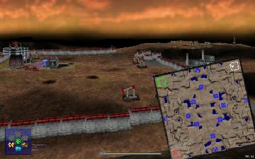

> **ARCHIVED**: This is an archive of an old map / mod from the old Addons site.

### [Map]

> [!IMPORTANT]
> This is an old map format. **Updated versions of maps are available in the Warzone 2100 Maps Database.**

# WastedLands

| | |
| - | - |
| __Author:__ | Berg |
| Addon-type: | __Map__ |
| __Game Version:__ | 3.1.0 |
| Created: | April 15, 2013, 12:21 a.m. |
| Oil: | Medium |
| Players: | 4 |
| Bases: | Normal bases |
| __License:__ | CC-BY-3.0 OR GPL-2.0-or-later |

> File: [4cWastedLand.wz](https://github.com/Warzone2100/old-addons-site/raw/main/assets/116/4cWastedLand.wz)  
> SHA256: fb60da0b5f87fd3775f5862abd59b1c29876182548a63cf3e0aac1593667e89a

## Description:

A Diorama map Tweaked in flame by

 Fabio_IT_[BDC] 

It is a four player map with medium oil

The scavs are fairly strong and Have nexus Towers so be warey.

Do not try to Use Ultimate Scav on with this map the Scavengers will be too strong.

