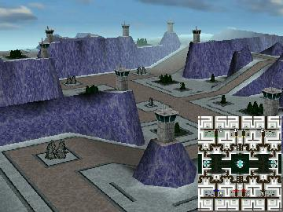

> **ARCHIVED**: This is an archive of an old map / mod from the old Addons site.

### [Map-Mod]

> [!IMPORTANT]
> Mods (or map-mods) **may not work properly or cause crashes / broken behavior** if used with a version of Warzone 2100 other than the one specified below

# Palace

| | |
| - | - |
| __Author:__ | NoQ |
| Addon-type: | __Map-Mod__ |
| __Game Version:__ | 3.1.0 [^1] |
| Created: | April 7, 2013, 2:47 a.m. |
| Oil: | Low |
| Players: | 6 |
| Bases: | Advanced Bases |
| Player Mode: | Skrimish/MP |
| Mod Category: | Graphics |
| __License:__ | CC0-1.0 |

> File: [6cPalace.wz](https://github.com/Warzone2100/old-addons-site/raw/main/assets/117/6cPalace.wz)  
> SHA256: f56492ec6ed87f3442f92555fd84c6d331fcf0db4f68745d790064261e106765

## Description:

A 3x3 map with custom textures known as "the marble tileset".

It's a team battle map with slightly more than 6 oils per player and very few key chokepoints for better teamwork.

[^1]: This archived mod is only tested with this older version of Warzone 2100, and is unlikely to work with more modern versions as-is.
