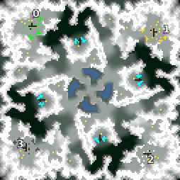

> **ARCHIVED**: This is an archive of an old map / mod from the old Addons site.

### [Map]

> [!IMPORTANT]
> This is an old map format. **Updated versions of maps are available in the Warzone 2100 Maps Database.**

# Freezing

| | |
| - | - |
| __Author:__ | NoQ |
| Addon-type: | __Map__ |
| __Game Version:__ | 3.1.0 |
| Created: | April 7, 2013, 2:49 a.m. |
| Oil: | Low |
| Players: | 4 |
| Bases: | Advanced Bases |
| __License:__ | CC0-1.0 |

> File: [4cFreezing101.wz](https://github.com/Warzone2100/old-addons-site/raw/main/assets/118/4cFreezing101.wz)  
> SHA256: eb1d31a161a2aa60fc1f32a79cb91e8a69767a70899dab795d6cb629602e5dce

## Description:

Medium-size FFA map with relatively clean texturing and richly varied terrain heightmap. 8 oils per player.

