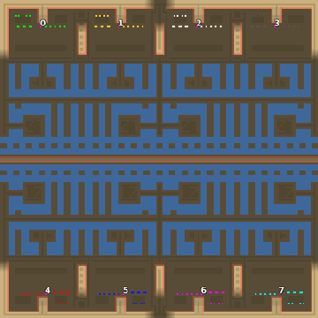

> **ARCHIVED**: This is an archive of an old map / mod from the old Addons site.

### [Map]

> [!IMPORTANT]
> This is an old map format. **Updated versions of maps are available in the Warzone 2100 Maps Database.**

# Mero_VTOLSWars

| | |
| - | - |
| __Author:__ | Merowingg |
| Addon-type: | __Map__ |
| __Game Version:__ | 3.1.0 |
| Created: | April 8, 2013, 7:18 p.m. |
| Oil: | High |
| Players: | 8 |
| Bases: | Normal bases |
| __License:__ | CC-BY-SA-3.0 OR GPL-2.0-or-later |

> File: [8cMero_VTOLSWars.wz](https://github.com/Warzone2100/old-addons-site/raw/main/assets/119/8cMero_VTOLSWars.wz)  
> SHA256: 6a1455ed7a874fb890677f5651d1c38ce968a1d445446e108fe2f0c34a51bce1

## Description:

Hello Gentlemen  

The map is called VTOLS Wars because it focuses almost entirely on using VTOLs and they are the necessary and only possible way on this particular map to finish the game  

No other mean of destruction can go to the opponents bases on the other side of the map because in exact middle of the map there is impassable wall which can be crossed by no wheels, halftracks, tracks or even hover.

The map is 200x200, I planned it in such way so there is enough room to built appropriate AA and plan the other base structures appropriately to VTOLs and VTOLs only attacks. The map is for eight players, and may be 3v3 or 4v4, 2v2 even, or any combination of 1/2 v1/2/3/4 and so on. Very important thing is that the opponents have to be on the opposite sides of the wall.

The map has advanced bases but very limited. There is no defence structure and no single AA included. It is up to you how you will defend and how place the AA. It is made for you to make you train the VTOLs area of the game. There is eight oils in base and another twelve around the map.

Again I used rich texturing, and some places are worth visiting. Do not underestimate long passages here there and everywhere. Also the islands accessible only by hovers can be of great importance. Think of what appropriate radars or long range weapons can do from there.

Also there are four very big LZs (landing zones) on the map which can be easily forgotten during the war chaos and think what if an enemy transport lands there.. or you can think of building a secret base on their side!

Ok so I repeat.

!!!The map is for VTOLS only! They are necessary to finish the game. You can also use cyborg transports to go onto enemys side. No other units than VTOLS, so wheels, halftracks, tracks, hovers will not be able to go onto enemys side because THERE IS UNPASSABLE WALL in the middle of the map. VTOLS HAVE TO BE TURNED ON to finish games on this map!!!

I did the name most clear as I could to indicate the VTOLS importance on it.

Have nice flights Gentlemen  

