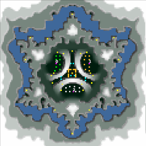

> **ARCHIVED**: This is an archive of an old map / mod from the old Addons site.

### [Map]

> [!IMPORTANT]
> This is an old map format. **Updated versions of maps are available in the Warzone 2100 Maps Database.**

# noway

| | |
| - | - |
| __Author:__ | tmp500 |
| Addon-type: | __Map__ |
| __Game Version:__ | 3.1.0 |
| Created: | March 19, 2013, 4:45 a.m. |
| Oil: | Low |
| Players: | 3 |
| Bases: | Advanced Bases |
| __License:__ | CC0-1.0 |

> File: [3cnoway.wz](https://github.com/Warzone2100/old-addons-site/raw/main/assets/12/3cnoway.wz)  
> SHA256: af595a14228fe1d1c9fae84ed22b5ee5205cbf1cf72c66de2443d7e323dbc281

## Description:

scavs in the center

