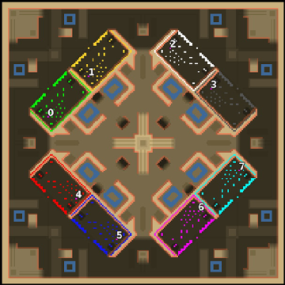

> **ARCHIVED**: This is an archive of an old map / mod from the old Addons site.

### [Map]

> [!IMPORTANT]
> This is an old map format. **Updated versions of maps are available in the Warzone 2100 Maps Database.**

# Mero_Arena

| | |
| - | - |
| __Author:__ | Merowingg |
| Addon-type: | __Map__ |
| __Game Version:__ | 3.1.0 |
| Created: | April 8, 2013, 2:48 p.m. |
| Oil: | High |
| Players: | 8 |
| Bases: | Advanced Bases |
| __License:__ | CC-BY-SA-3.0 OR GPL-2.0-or-later |

> File: [8cMero_Arena.wz](https://github.com/Warzone2100/old-addons-site/raw/main/assets/121/8cMero_Arena.wz)  
> SHA256: 8861972da68663ae841ad7382e9689b486b856392d65571880e811bfe8e3a5f6

## Description:

Hello Gentlemen  

I am happy to present the Arena map  

As the map indicates it is a sort of arena on which quite interesting or at least different battles can be performed  

The map is 200x200, it is for eight players, eight oils in base, and another twelf around the map per player. Advanced bases are included.

The map is very good for FAA, as well as 2v2v2v2 or 3v3 and finally 4v4

Its particular pattern allows to make 2v6 battles too, so called beginners versus professional. As those two in one section can theoretically easily close their area.

The interesting feature of this map is that all the players have their opponents behind them, what is more islands on water behind the bases are added to avoid concentrating of buildings or heavy units there, but the islands if used wisely  can be really useful.

The point is oils are not only in the centre but also at the corners of the map and its middle which is supposed to make your heads go around all the time  If thought through loosing one part of the map does not have to mean losing the game, and some areas are advisable to be fortified.

Have fun gentlemen  

