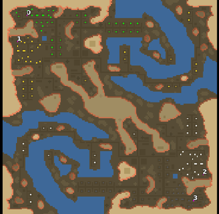

> **ARCHIVED**: This is an archive of an old map / mod from the old Addons site.

### [Map]

> [!IMPORTANT]
> This is an old map format. **Updated versions of maps are available in the Warzone 2100 Maps Database.**

# Mero_Airport

| | |
| - | - |
| __Author:__ | Merowingg |
| Addon-type: | __Map__ |
| __Game Version:__ | 3.1.0 |
| Created: | April 8, 2013, 7:18 p.m. |
| Oil: | Medium |
| Players: | 4 |
| Bases: | Advanced Bases |
| __License:__ | CC-BY-SA-3.0 OR GPL-2.0-or-later |

> File: [4cMero_Airport.wz](https://github.com/Warzone2100/old-addons-site/raw/main/assets/122/4cMero_Airport.wz)  
> SHA256: 38557aa1431c3a2f196f09b09019c7b0e88970c24a53159d777428f54bf9bf0c

## Description:

Hello Gentlemen  

I was really busy lately but step by step I managed to make another map idea of which I have told you not so long ago  

The map is called Airport because you will see a lot of Tank Transports on it  

!!! The Tank Transports cannot be used !!! They are only to look cool and make the whole idea of the airport !!!

!!! I remind you that to see them advanced bases must be on and at places where your transports are the map is automatically uncovered and the terrain visible !!!

If those two facts do not push you away then enjoy the map  

The map is 180 x 180, 13,5  oils per player, the map is designed to be 1 v 1 or 2 v 2, the 1 v 1 v 1 v 1 is not good to be played !!! as the bases are located 2 v 2 where each 2 is next to each ather, but you will do whatever you wish  Advanced bases are included.

The tileset is really nice, I did my best and it took me a lot of time to make the bases look cool and the tank transports layout and airport realistic  

Have fresh air at the airport and do your best to win  

Bye  

