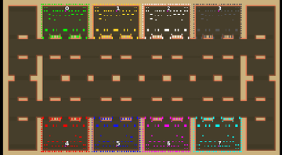

> **ARCHIVED**: This is an archive of an old map / mod from the old Addons site.

### [Map]

> [!IMPORTANT]
> This is an old map format. **Updated versions of maps are available in the Warzone 2100 Maps Database.**

# Mero_NTWCanyon

| | |
| - | - |
| __Author:__ | Merowingg |
| Addon-type: | __Map__ |
| __Game Version:__ | 3.1.0 |
| Created: | April 8, 2013, 7:18 p.m. |
| Oil: | High |
| Players: | 8 |
| Bases: | Advanced Bases |
| __License:__ | CC-BY-SA-3.0 OR GPL-2.0-or-later |

> File: [8cMero_NTWCanyon.wz](https://github.com/Warzone2100/old-addons-site/raw/main/assets/123/8cMero_NTWCanyon.wz)  
> SHA256: ed0e49224b806dc2c10d62c9324672f1a5aa2c3d14928e7c250b2f715bc848d5

## Description:

Hello Gentlemen  

Don’t be scared another NTW is created already  It is called Canyon. It is called so because it is a place near the NTW castle, the canyon is dangerous and very narrow..

The map is 140 x 250, for eight players, 8 oils in base  (success  ) and another 12 per player here there and everywhere (another success  ) advanced bases included.

The area between the opposite bases is very small, that is why I have added few walls to stop ultrarush from being performed.. also those boxes on the left and on the right are interesting places too both in terms of tactics and oil  

Have fun gentlemen  and remember on this one the rules are a little bit different than on other NTWs 

