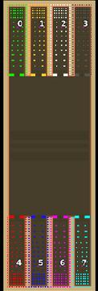

> **ARCHIVED**: This is an archive of an old map / mod from the old Addons site.

### [Map]

> [!IMPORTANT]
> This is an old map format. **Updated versions of maps are available in the Warzone 2100 Maps Database.**

# Mero_NTWPath

| | |
| - | - |
| __Author:__ | Merowingg |
| Addon-type: | __Map__ |
| __Game Version:__ | 3.1.0 |
| Created: | April 8, 2013, 2:48 p.m. |
| Oil: | Extreme |
| Players: | 8 |
| Bases: | Advanced Bases |
| __License:__ | CC-BY-SA-3.0 OR GPL-2.0-or-later |

> File: [8cMero_NTWPath.wz](https://github.com/Warzone2100/old-addons-site/raw/main/assets/124/8cMero_NTWPath.wz)  
> SHA256: 5551971719e18f3debc33b9bbadb9f6e5e91515b3ccc136e058bee80504cd23f

## Description:

Hello Gentlemen  

I have created NTW Path because when I finished NTW Canyon I couldn’t stop myself from narrowing the NTW the other way  

It is a path near the NTW Castle where entire NTW Court is settled down  

The path is extremely narrow so again the NTW features are at least a little bit changed.

The map is 250x80, for eight players, 30 oils in base, advanced bases are included.

I have put not many defences in from of each base to make you to decide how will you protect your own base. It seems to be very easy to protect so narrow entrances but remember to make the entrances passable enough for appropriate military actions. You can always (very often it is even advisable) that you will cooperate with the other players to make appropriate defences.

The oil at the back of the base is so placed that he makes no traffic for trucks handling with it.

Have fun gentlemen  

The narrower the path the greater the tense  

