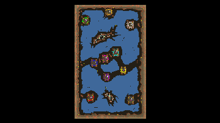

> **ARCHIVED**: This is an archive of an old map / mod from the old Addons site.

### [Map]

> [!IMPORTANT]
> This is an old map format. **Updated versions of maps are available in the Warzone 2100 Maps Database.**

# Orion

| | |
| - | - |
| __Author:__ | sensor |
| Addon-type: | __Map__ |
| __Game Version:__ | 3.1.0 |
| Created: | April 12, 2013, 9:33 p.m. |
| Oil: | Low |
| Players: | 10 |
| Bases: | Advanced Bases |
| __License:__ | CC0-1.0 |

> File: [10cOrion.wz](https://github.com/Warzone2100/old-addons-site/raw/main/assets/125/10cOrion.wz)  
> SHA256: c6391fc2947e570bf38513e7e1ff1cf416c97c2bb0bbc4bd5eafd9d3a6aa5803

## Description:

Map of 10 players from scavengers.

Oil sources are on the sides of most maps.

