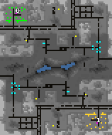

> **ARCHIVED**: This is an archive of an old map / mod from the old Addons site.

### [Map]

> [!IMPORTANT]
> This is an old map format. **Updated versions of maps are available in the Warzone 2100 Maps Database.**

# Urban Mystery

| | |
| - | - |
| __Author:__ | NoQ |
| Addon-type: | __Map__ |
| __Game Version:__ | 3.1.0 |
| Created: | April 13, 2013, 12:09 p.m. |
| Oil: | Low |
| Players: | 2 |
| Bases: | Advanced Bases |
| __License:__ | CC0-1.0 |

> File: [2cUrbanMystery.wz](https://github.com/Warzone2100/old-addons-site/raw/main/assets/128/2cUrbanMystery.wz)  
> SHA256: 3387e94c92381167f56f0bfb60e4cd5ad24597e94392a5135e980ae19e4d4bbc

## Description:

A duel map that demonstrates many new features of v3.1, like neutral walls, bridge features, nuclear reactors, white-on-blue trees and top-secret laboratories. 

