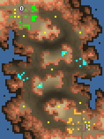

> **ARCHIVED**: This is an archive of an old map / mod from the old Addons site.

### [Map]

> [!IMPORTANT]
> This is an old map format. **Updated versions of maps are available in the Warzone 2100 Maps Database.**

# Breach

| | |
| - | - |
| __Author:__ | NoQ |
| Addon-type: | __Map__ |
| __Game Version:__ | 3.1.0 |
| Created: | April 1, 2013, 4:59 a.m. |
| Oil: | Medium |
| Players: | 2 |
| Bases: | Advanced Bases |
| __License:__ | CC0-1.0 |

> File: [2cBreach101.wz](https://github.com/Warzone2100/old-addons-site/raw/main/assets/13/2cBreach101.wz)  
> SHA256: 29fc15df5e7ed0bd25f23c44637203d1726edd48cf49f8232b2dd62980e0b79a

## Description:

A map designed for competitive 1x1 duels. Its pecularities include multiple defensive positions, non-blocking scavenger spots, large amounts of destroyable features to spice up early micromanagement, and relatively tight starting positions.

