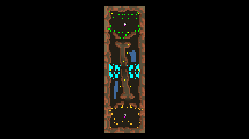

> **ARCHIVED**: This is an archive of an old map / mod from the old Addons site.

### [Map]

> [!IMPORTANT]
> This is an old map format. **Updated versions of maps are available in the Warzone 2100 Maps Database.**

# Tapeworm

| | |
| - | - |
| __Author:__ | sensor |
| Addon-type: | __Map__ |
| __Game Version:__ | 3.1.0 |
| Created: | April 16, 2013, 4:48 a.m. |
| Oil: | Medium |
| Players: | 2 |
| Bases: | Advanced Bases |
| __License:__ | CC0-1.0 |

> File: [2cTapeworm.wz](https://github.com/Warzone2100/old-addons-site/raw/main/assets/134/2cTapeworm.wz)  
> SHA256: d806823546eb51466813974fca45bd335c2822eacd434ce3336bdc95fca2e42e

## Description:

Longitudinal map for two players from scavengers.

