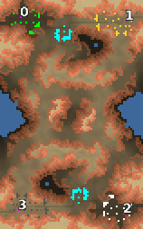

> **ARCHIVED**: This is an archive of an old map / mod from the old Addons site.

### [Map]

> [!IMPORTANT]
> This is an old map format. **Updated versions of maps are available in the Warzone 2100 Maps Database.**

# Clash

| | |
| - | - |
| __Author:__ | NoQ |
| Addon-type: | __Map__ |
| __Game Version:__ | 3.1.0 |
| Created: | April 17, 2013, 4:59 a.m. |
| Oil: | Medium |
| Players: | 4 |
| Bases: | Advanced Bases |
| __License:__ | CC0-1.0 |

> File: [4cClash102.wz](https://github.com/Warzone2100/old-addons-site/raw/main/assets/137/4cClash102.wz)  
> SHA256: 9029ae90d5b1823c2a3aaa13fbd43148b72a758959bda25f2ed3ca23f934d23d

## Description:

A 2x2 team battle map. Each player has a chokepoint to defend, observable from highground.

