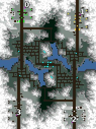

> **ARCHIVED**: This is an archive of an old map / mod from the old Addons site.

### [Map]

> [!IMPORTANT]
> This is an old map format. **Updated versions of maps are available in the Warzone 2100 Maps Database.**

# Village

| | |
| - | - |
| __Author:__ | NoQ |
| Addon-type: | __Map__ |
| __Game Version:__ | 3.1.0 |
| Created: | April 17, 2013, 5:01 a.m. |
| Oil: | Low |
| Players: | 4 |
| Bases: | Advanced Bases |
| __License:__ | CC0-1.0 |

> File: [4cVillage101.wz](https://github.com/Warzone2100/old-addons-site/raw/main/assets/138/4cVillage101.wz)  
> SHA256: bb4884d2db9102a500eedc8c50e4a163a20c2e64715ef912b8f6dfa3be06b7ac

## Description:

A 2x2 team map with a lot of log cabins. 

