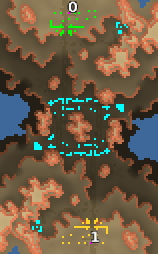

> **ARCHIVED**: This is an archive of an old map / mod from the old Addons site.

### [Map]

> [!IMPORTANT]
> This is an old map format. **Updated versions of maps are available in the Warzone 2100 Maps Database.**

# Calamity

| | |
| - | - |
| __Author:__ | NoQ |
| Addon-type: | __Map__ |
| __Game Version:__ | 3.1.0 |
| Created: | April 17, 2013, 5:08 a.m. |
| Oil: | Medium |
| Players: | 2 |
| Bases: | Advanced Bases |
| __License:__ | CC0-1.0 |

> File: [2cCalamity.wz](https://github.com/Warzone2100/old-addons-site/raw/main/assets/139/2cCalamity.wz)  
> SHA256: b18823a305960dadb1b16d8e09d3af4e457b14352a0e773dc1de2a41a72c8812

## Description:

A map for competitive 1x1 duels. Its two middle chokepoints are relatively wide, yet filled with neutral huts to make moving through difficult on the early game phase. Additionally, it includes a large scavenger base at the middle. 

If anybody's interested, this map used to be the primary testing ground for development of NullBot AI, together with "VisionX2" for 1x2 matches against weaker AIs, until replaced by "Breach".

