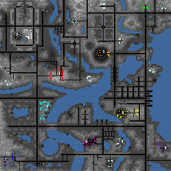

> **ARCHIVED**: This is an archive of an old map / mod from the old Addons site.

### [Map]

> [!IMPORTANT]
> This is an old map format. **Updated versions of maps are available in the Warzone 2100 Maps Database.**

# Riviera

| | |
| - | - |
| __Author:__ | NoQ |
| Addon-type: | __Map__ |
| __Game Version:__ | 3.1.0 |
| Created: | March 20, 2013, 3:35 a.m. |
| Oil: | Low |
| Players: | 10 |
| Bases: | Advanced Bases |
| __License:__ | CC0-1.0 |

> File: [10cRiviera.wz](https://github.com/Warzone2100/old-addons-site/raw/main/assets/14/10cRiviera.wz)  
> SHA256: 03af763383bb2ae9ae997662b19a9c68c1b297b490da461be8fb633e37f741e0

## Description:

A huge asymmetric low-oil 10-player map designed mostly for skirmish games. Starting positions are unbalanced both in the sense of number of chokes and in the amount of oils. You may try a few and pick your favorite spot or check out different sorts of games emerging from different human and AI player layouts. 

