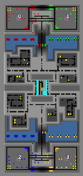

> **ARCHIVED**: This is an archive of an old map / mod from the old Addons site.

### [Map]

> [!IMPORTANT]
> This is an old map format. **Updated versions of maps are available in the Warzone 2100 Maps Database.**

# Arena #14

| | |
| - | - |
| __Author:__ | Olrox |
| Addon-type: | __Map__ |
| __Game Version:__ | 3.1.0 |
| Created: | April 19, 2013, 3:10 a.m. |
| Oil: | Medium |
| Players: | 4 |
| Bases: | Advanced Bases |
| __License:__ | CC-BY-SA-3.0 OR GPL-2.0-or-later |

> File: [4cArena_14.wz](https://github.com/Warzone2100/old-addons-site/raw/main/assets/140/4cArena_14.wz)  
> SHA256: 8bc986184c20aaa333617aeb7bf268d037e3ee28cf517298bf843a4972aac577

## Description:

This is the urban arena I've created, with great attention to detail and texturing. It supports free-for-all, 1x1 (with two building grounds for each player) or 2x2 gameplay.

