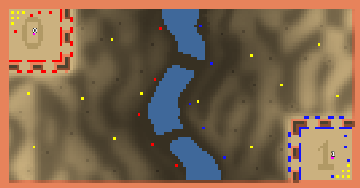

> **ARCHIVED**: This is an archive of an old map / mod from the old Addons site.

### [Map]

> [!IMPORTANT]
> This is an old map format. **Updated versions of maps are available in the Warzone 2100 Maps Database.**

# Arena #22

| | |
| - | - |
| __Author:__ | Olrox |
| Addon-type: | __Map__ |
| __Game Version:__ | 3.1.0 |
| Created: | April 26, 2013, 5:29 a.m. |
| Oil: | High |
| Players: | 2 |
| Bases: | Advanced Bases |
| __License:__ | CC-BY-SA-3.0 OR GPL-2.0-or-later |

> File: [2cArena_22.wz](https://github.com/Warzone2100/old-addons-site/raw/main/assets/141/2cArena_22.wz)  
> SHA256: 22e5e8f118fca7331ee3012fcb12fa7318024ab2df80ae84a3ec8a1b5750bb09

## Description:

This is the heads-on desert arena I've created. Its dunes are designed to provide an innovative gameplay experience, introducing many new defensive tactics possibilities. It diversifies the terrain without much usage of cliffs, and allows very competitive games.

