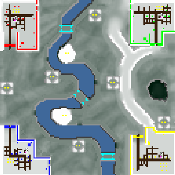

> **ARCHIVED**: This is an archive of an old map / mod from the old Addons site.

### [Map]

> [!IMPORTANT]
> This is an old map format. **Updated versions of maps are available in the Warzone 2100 Maps Database.**

# Garond Valley

| | |
| - | - |
| __Author:__ | Olrox |
| Addon-type: | __Map__ |
| __Game Version:__ | 3.1.0 |
| Created: | April 19, 2013, 3:19 a.m. |
| Oil: | Medium |
| Players: | 4 |
| Bases: | Advanced Bases |
| __License:__ | CC-BY-SA-3.0 OR GPL-2.0-or-later |

> File: [4cGarondValley.wz](https://github.com/Warzone2100/old-addons-site/raw/main/assets/142/4cGarondValley.wz)  
> SHA256: 55e2df7935b9bd6b8d2b5976203f7798d1a3f5aeecb356a93c3322f800b61b82

## Description:

This is a mountain tileset map I've created to promote an intensive dispute over resources. They are evidently marked on the map, so everyone can find them easily. This map promotes extended games since the bases are naturally strongly fortified (by cliffs).

