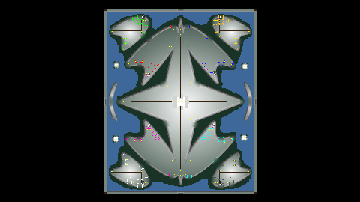

> **ARCHIVED**: This is an archive of an old map / mod from the old Addons site.

### [Map]

> [!IMPORTANT]
> This is an old map format. **Updated versions of maps are available in the Warzone 2100 Maps Database.**

# Port

| | |
| - | - |
| __Author:__ | sensor |
| Addon-type: | __Map__ |
| __Game Version:__ | 3.1.0 |
| Created: | April 19, 2013, 4:33 a.m. |
| Oil: | Medium |
| Players: | 8 |
| Bases: | Advanced Bases |
| __License:__ | CC0-1.0 |

> File: [8cPort.wz](https://github.com/Warzone2100/old-addons-site/raw/main/assets/143/8cPort.wz)  
> SHA256: 3be55dcdb0a9a02b90a57bc390814b0b51d8fec5370a4b1cd0c32caed7aab28b

## Description:

Pretty big map for 8 players.

