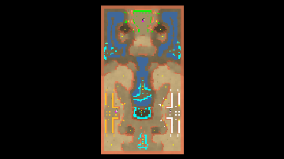

> **ARCHIVED**: This is an archive of an old map / mod from the old Addons site.

### [Map]

> [!IMPORTANT]
> This is an old map format. **Updated versions of maps are available in the Warzone 2100 Maps Database.**

# Sector_G1

| | |
| - | - |
| __Author:__ | sensor |
| Addon-type: | __Map__ |
| __Game Version:__ | 3.1.0 |
| Created: | April 19, 2013, 5:05 a.m. |
| Oil: | Medium |
| Players: | 3 |
| Bases: | Advanced Bases |
| __License:__ | CC0-1.0 |

> File: [3cSector_G1.wz](https://github.com/Warzone2100/old-addons-site/raw/main/assets/145/3cSector_G1.wz)  
> SHA256: ddb034eab0cda801d8e7ae381d888360266c9ea2cfc71394c7688185da1bd317

## Description:

Map of three players from scavengers.

