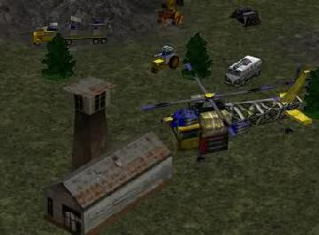

> **ARCHIVED**: This is an archive of an old map / mod from the old Addons site.

### [Mod]

> [!IMPORTANT]
> Mods (or map-mods) **may not work properly or cause crashes / broken behavior** if used with a version of Warzone 2100 other than the one specified below

# Ultimate Scavenger AI

| | |
| - | - |
| __Author:__ | NoQ |
| Addon-type: | __Mod__ |
| __Game Version:__ | 3.1.1 [^1] |
| Created: | Sept. 27, 2014, 8 a.m. |
| Player Mode: | Skrimish/MP |
| Mod Category: | AI |
| __License:__ | CC0-1.0 |

> File: [ultimatescavs116.mod.wz](https://github.com/Warzone2100/old-addons-site/raw/main/assets/148/ultimatescavs116.mod.wz)  
> SHA256: 724b9515c5d753e586a848e7cbb3c24de81a72e6a33c64340686cbc5a029d782

## Description:

This mod is supposed to make the A.I. script that controls skirmish game scavengers come up with some advanced behavior, such as capturing oil derricks, building bases and defensive structures.

They will also repair their vehicles, produce different sorts of helicopters, three-turret war trucks and nexus link tanks.

v1.15: keep up with balance changes of Warzone 2100 v3.1.1.

v1.16: fix broken weapon sounds.

[^1]: This archived mod is only tested with this older version of Warzone 2100, and is unlikely to work with more modern versions as-is.
