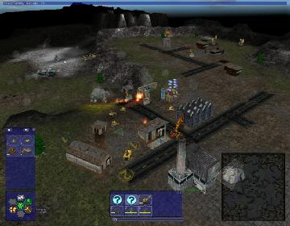

> **ARCHIVED**: This is an archive of an old map / mod from the old Addons site.

### [Mod]

> [!IMPORTANT]
> Mods (or map-mods) **may not work properly or cause crashes / broken behavior** if used with a version of Warzone 2100 other than the one specified below

# WZ Mini: Scavenger Wars

| | |
| - | - |
| __Author:__ | NoQ |
| Addon-type: | __Mod__ |
| __Game Version:__ | 3.1.0 [^1] |
| Created: | April 23, 2013, 6:42 a.m. |
| Player Mode: | Skrimish/MP |
| Mod Category: | Stats (Balance) |
| __License:__ | CC0-1.0 |

> File: [wzmini012.mod.wz](https://github.com/Warzone2100/old-addons-site/raw/main/assets/149/wzmini012.mod.wz)  
> SHA256: 0d04f97023a8b88eabe15c3aa220acb98cc5adebc2e18196a93d18b196bbadfb

## Description:

A mod that makes you play as scavengers in skirmish games. You build scavenger structures and produce scavenger vehicles.

See this picture for the complete tech tree:

http://forums.wz2100.net/download/file.php?id=12600&mode=view

To play skirmish games choose NullBot ~Mini~ as your opponent (supplied with the mod); other AIs will not work.

[^1]: This archived mod is only tested with this older version of Warzone 2100, and is unlikely to work with more modern versions as-is.
