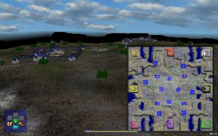

> **ARCHIVED**: This is an archive of an old map / mod from the old Addons site.

### [Map]

> [!IMPORTANT]
> This is an old map format. **Updated versions of maps are available in the Warzone 2100 Maps Database.**

# NoMansLand

| | |
| - | - |
| __Author:__ | Berg |
| Addon-type: | __Map__ |
| __Game Version:__ | 3.1.0 |
| Created: | April 24, 2013, 6:48 a.m. |
| Oil: | Low |
| Players: | 8 |
| Bases: | Normal bases |
| __License:__ | CC-BY-3.0 OR GPL-2.0-or-later |

> File: [8cnomansland.wz](https://github.com/Warzone2100/old-addons-site/raw/main/assets/152/8cnomansland.wz)  
> SHA256: 31358cd40f7769b85573b246d4045b4c08f19c9cea4f625fee11940890a068f4

## Description:

8 player map with low oil

Heavy scav camps in middle

