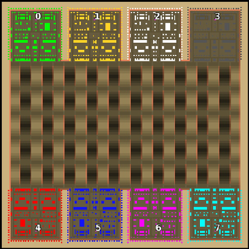

> **ARCHIVED**: This is an archive of an old map / mod from the old Addons site.

### [Map]

> [!IMPORTANT]
> This is an old map format. **Updated versions of maps are available in the Warzone 2100 Maps Database.**

# Mero_NTWRoad

| | |
| - | - |
| __Author:__ | Merowingg |
| Addon-type: | __Map__ |
| __Game Version:__ | 3.1.0 |
| Created: | April 24, 2013, 7:40 p.m. |
| Oil: | Extreme |
| Players: | 8 |
| Bases: | Advanced Bases |
| __License:__ | CC-BY-SA-3.0 OR GPL-2.0-or-later |

> File: [8cMero_NTWRoad.wz](https://github.com/Warzone2100/old-addons-site/raw/main/assets/153/8cMero_NTWRoad.wz)  
> SHA256: f2ea6ec24c9f0958d5442f8f9ecdcd473fedac98586ef117e6c6751b5d2ea004

## Description:

Hello Gentlemen  

So far you have been introduced to many court members of NTW family and there will be more for sure  

At the same time I decided to put into NTW world some places near the royal court castle  

As a result here I am to give you the NTWRoad  The preview of the map does not show why the map is called road, but the screen taken during the game does. It is simply the road or shall I say a lot of roads connected into one very big one.

The map is 200x200, for eight players, 40 oils in base, advanced bases included.

I have tried to vary the pattern of how I put NTW bases on the NTW maps and I think I have managed at least partly  I will keep on experimenting now.

Be sure to see here not only people from the court but also areas near the castle, maybe even the castle itself!

Have fun gentlemen  

