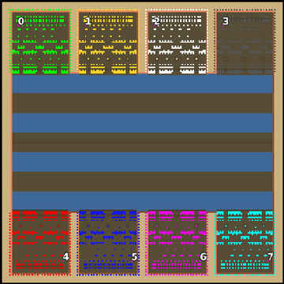

> **ARCHIVED**: This is an archive of an old map / mod from the old Addons site.

### [Map]

> [!IMPORTANT]
> This is an old map format. **Updated versions of maps are available in the Warzone 2100 Maps Database.**

# Mero_NTWSiren

| | |
| - | - |
| __Author:__ | Merowingg |
| Addon-type: | __Map__ |
| __Game Version:__ | 3.1.0 |
| Created: | April 24, 2013, 7:45 p.m. |
| Oil: | Extreme |
| Players: | 8 |
| Bases: | Advanced Bases |
| __License:__ | CC-BY-SA-3.0 OR GPL-2.0-or-later |

> File: [8cMero_NTWSiren.wz](https://github.com/Warzone2100/old-addons-site/raw/main/assets/154/8cMero_NTWSiren.wz)  
> SHA256: f19f17c622535998ad18236154671adcf46cda9bc631105baa4695e08e6c3a98

## Description:

Hello Gentlemen  

I have made.. another NTW map.. dont hate me please  

The map is called Siren, because in those water between opposite set bases the siren lives  The King and Queen know about her but she is harmless so she can live in the waters near the castle freely  

The map is 200 x 200, for 8 players, 40 oils in base, advanced bases included.

As you can see to get to the enemy and finish the game hovers or vtols are needed.

The three strips of land between the bases are allow to built some more defences or structures.

Have fun  

