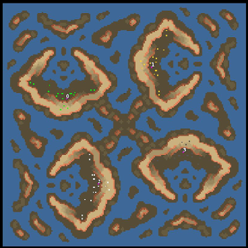

> **ARCHIVED**: This is an archive of an old map / mod from the old Addons site.

### [Map]

> [!IMPORTANT]
> This is an old map format. **Updated versions of maps are available in the Warzone 2100 Maps Database.**

# Mero_Claws

| | |
| - | - |
| __Author:__ | Merowingg |
| Addon-type: | __Map__ |
| __Game Version:__ | 3.1.0 |
| Created: | April 24, 2013, 7:49 p.m. |
| Oil: | High |
| Players: | 4 |
| Bases: | Normal bases |
| __License:__ | CC-BY-SA-3.0 OR GPL-2.0-or-later |

> File: [4cMero_Claws.wz](https://github.com/Warzone2100/old-addons-site/raw/main/assets/155/4cMero_Claws.wz)  
> SHA256: 5da7b49a0907e3db8cd2d4b2110790f3b5b373553cac1c7c68c21b3849151d9a

## Description:

Hello Gentlemen  

After a long struggle and some unexpected events I managed to create another map  

It is called claws because of the four claws that are clearly visible on the map preview.

The map is for four players, it supports hovers strongly but is so designed that ground units will travel to the main bases without any problems, well theoretically  The claws protect each main base, it might be well fortified, but there is still this water gap where hovers may enter, but the gap is possible to be protected too  

There is 6 oils in main base, and another 16 around the map including the isles. Advanced bases included.

Have fun gentlemen  

