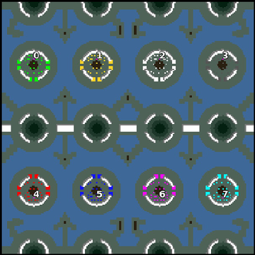

> **ARCHIVED**: This is an archive of an old map / mod from the old Addons site.

### [Map]

> [!IMPORTANT]
> This is an old map format. **Updated versions of maps are available in the Warzone 2100 Maps Database.**

# Mero_Arrows

| | |
| - | - |
| __Author:__ | Merowingg |
| Addon-type: | __Map__ |
| __Game Version:__ | 3.1.0 |
| Created: | April 24, 2013, 7:56 p.m. |
| Oil: | Extreme |
| Players: | 8 |
| Bases: | Normal bases |
| __License:__ | CC-BY-SA-3.0 OR GPL-2.0-or-later |

> File: [8cMero_Arrows.wz](https://github.com/Warzone2100/old-addons-site/raw/main/assets/156/8cMero_Arrows.wz)  
> SHA256: 84d065f3324d5387bdd2b8f6fbec30ceac7d8167ad67d07a64a07c8c9b2946bf

## Description:

Hello Gentlemen  

I have decided to do another hover map and here is the result  

The map is called Arrows, because few arrows are clearly visible on the maps preview. The map is for eight players. Each player has his own base on his own island and each base is protected by high natural walls so there is only three entrances to each base. As a result it is at least a little easier to protect a players base. The map is for hovers and vtols only, so to win the game and go to the enemy base you have to have at least one of those two weapons of war.

The map is 200x200, There is 6 oils in each base and another 19 per player on the map. Advanced bases are included.

The islands are of course separate but behind all of them there is a line of land, and also in the middle there is a line of land so gaining territory step by step or protecting some areas with time is possible and even advisable for better gaming results.

Have fun gentlemen  

