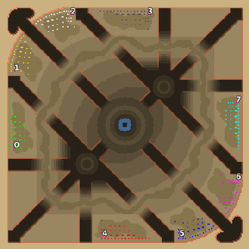

> **ARCHIVED**: This is an archive of an old map / mod from the old Addons site.

### [Map]

> [!IMPORTANT]
> This is an old map format. **Updated versions of maps are available in the Warzone 2100 Maps Database.**

# Mero_NTWSpy

| | |
| - | - |
| __Author:__ | Merowingg |
| Addon-type: | __Map__ |
| __Game Version:__ | 3.1.0 |
| Created: | April 25, 2013, 2:44 p.m. |
| Oil: | Extreme |
| Players: | 8 |
| Bases: | Advanced Bases |
| __License:__ | CC-BY-SA-3.0 OR GPL-2.0-or-later |

> File: [8cMero_NTWSpy.wz](https://github.com/Warzone2100/old-addons-site/raw/main/assets/158/8cMero_NTWSpy.wz)  
> SHA256: f31e6ba502ff8194786492e5082f52371f13d901beff78e47354b721dddece01

## Description:

Hello Gentlemen  

Finally I have managed to finish this map, but I have to admit I was distracted by many things while I was working on it countless number of times..

Dont be scared when you see NTW in title ! it has some features of NTW but as you well know I redefine NTW and Squared all the time  

NTW Court hired a spy, he is to watch you, that is why when you look closer to the maps preview you will see the enormous eye of the spy. But not only he is to watch you, you have to spy on other players too, and there is many corners and paths to be searched and taken care of not necessarily being seen. If you will not look closely you can easily be surprised by enemy arrival or hidden troops.

The map is 220 x 220, for eight players, fifteen oils in base and another 14 per player on the map. Advanced bases are included.

Have fun  

