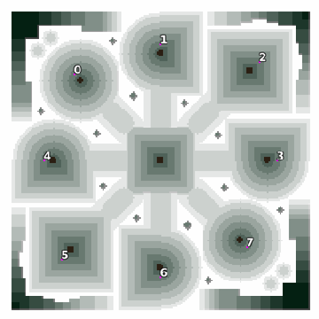

> **ARCHIVED**: This is an archive of an old map / mod from the old Addons site.

### [Map]

> [!IMPORTANT]
> This is an old map format. **Updated versions of maps are available in the Warzone 2100 Maps Database.**

# Mero_TallGrass

| | |
| - | - |
| __Author:__ | Merowingg |
| Addon-type: | __Map__ |
| __Game Version:__ | 3.1.0 |
| Created: | April 25, 2013, 2:47 p.m. |
| Oil: | High |
| Players: | 8 |
| Bases: | No bases |
| __License:__ | CC-BY-SA-3.0 OR GPL-2.0-or-later |

> File: [8cMero_TallGrass.wz](https://github.com/Warzone2100/old-addons-site/raw/main/assets/159/8cMero_TallGrass.wz)  
> SHA256: a460abc0c376926394fa8402a566b8e4e0088de4340ba9400cea6a201a29a16d

## Description:

Hello Gentlemen  

The main aim of this map was simplicity  it is extremely rush friendly.. but do not always have to be.

It is called Tall Grass because there is a lot of grass on it.

The map is for eight players, eight oils in base and another twelve around the map. No advanced bases this time ! It is you who will decide how to organize within your valleys.

The map is extremely open, but there was no such open map by me for almost a year so it is no crime.

The map is open but you will find quite a lot trees on it  

Have fun  

