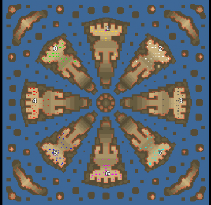

> **ARCHIVED**: This is an archive of an old map / mod from the old Addons site.

### [Map]

> [!IMPORTANT]
> This is an old map format. **Updated versions of maps are available in the Warzone 2100 Maps Database.**

# Mero_WaterCog

| | |
| - | - |
| __Author:__ | Merowingg |
| Addon-type: | __Map__ |
| __Game Version:__ | 3.1.0 |
| Created: | April 25, 2013, 2:51 p.m. |
| Oil: | Extreme |
| Players: | 8 |
| Bases: | Advanced Bases |
| __License:__ | CC-BY-SA-3.0 OR GPL-2.0-or-later |

> File: [8cMero_WaterCog.wz](https://github.com/Warzone2100/old-addons-site/raw/main/assets/160/8cMero_WaterCog.wz)  
> SHA256: 1e97930cb849741f2b7d21deee28832c6b432ead085a52bc1e78f8725b9f67e1

## Description:

Hello gentlemen  

The map is called Water Cog because in preview it look like a cog on water  

It is only hover so and vtol map, the enemys/allies can only be reached by hovers and vtols.

The map is for eight players, each player starts on separate island, with 8 oils near them, and another 10 spread on his islands. Then yet another 16 on the little islands around the map, so the map is 34 oils per player, 8/10/16. Advanced bases included.

The map is big 240 x 240, it is because I wanted to give you big islands to have terrain to work with, each island is designed in such a way that only one way leads to the mainland from the centre of the map, so you have bigger ability to turtle, yet not so big, but you cannot be attacked directly from any side as it was on my previous islands maps. But still oil derricks are placed near cliffs on purpose.

Inside the main land eight oils allow you to have at least something if the situation gets bad, the rest ten oils around the map is harder to protect, so you are to do it wisely. The oil on little islands around is spread in such way that you can always smuggle one tiny truck  somewhere to take oil, the islands are small except those at corners, I made them small on purpose, I did not want to allow building here there and everywhere this time.

The map is supposed to make you be alerted all the time as it is really hard to maintain this sea  

Have fun gentlemen  

