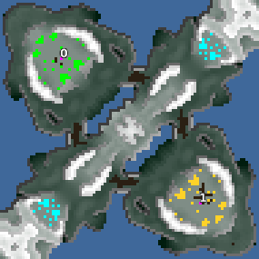

> **ARCHIVED**: This is an archive of an old map / mod from the old Addons site.

### [Map]

> [!IMPORTANT]
> This is an old map format. **Updated versions of maps are available in the Warzone 2100 Maps Database.**

# Serenity

| | |
| - | - |
| __Author:__ | NoQ |
| Addon-type: | __Map__ |
| __Game Version:__ | 3.1.0 |
| Created: | April 27, 2013, 11:41 a.m. |
| Oil: | Medium |
| Players: | 2 |
| Bases: | Advanced Bases |
| __License:__ | CC0-1.0 |

> File: [2cSerenity.wz](https://github.com/Warzone2100/old-addons-site/raw/main/assets/162/2cSerenity.wz)  
> SHA256: 277a2501c5dda29c2dcea7eae2ba092e2898b8cb5a832ae20982a217bd0fc911

## Description:

A small 1x1 duel map with gameplay focusing on flank control.

