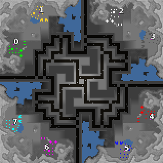

> **ARCHIVED**: This is an archive of an old map / mod from the old Addons site.

### [Map]

> [!IMPORTANT]
> This is an old map format. **Updated versions of maps are available in the Warzone 2100 Maps Database.**

# Rush Hour

| | |
| - | - |
| __Author:__ | NoQ |
| Addon-type: | __Map__ |
| __Game Version:__ | 3.1.0 |
| Created: | April 27, 2013, 11:52 a.m. |
| Oil: | Medium |
| Players: | 8 |
| Bases: | Advanced Bases |
| __License:__ | CC0-1.0 |

> File: [8cRushHour.wz](https://github.com/Warzone2100/old-addons-site/raw/main/assets/164/8cRushHour.wz)  
> SHA256: f17d99db2d7eed566f362820f6a4e631ce7f8fb0428edda16cb9a63aa61bef65

## Description:

A large 2x2x2x2 team FFA map.

The middle is pretty special. There are 5 oils here, 4 of which can be targeted from the middle, but cannot be easily accessed from there. So controlling the middle gives you just a few extra oil, but completely turtling in your bases will actually give your enemy much more extra oils. There are also 8 oil drums in the middle, accessible only by tanks; 4 of the middle oils are also blocked.

