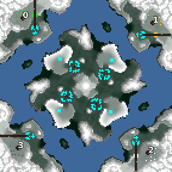

> **ARCHIVED**: This is an archive of an old map / mod from the old Addons site.

### [Map]

> [!IMPORTANT]
> This is an old map format. **Updated versions of maps are available in the Warzone 2100 Maps Database.**

# Whirlpool

| | |
| - | - |
| __Author:__ | NoQ |
| Addon-type: | __Map__ |
| __Game Version:__ | 3.1.0 |
| Created: | April 27, 2013, 12:08 p.m. |
| Oil: | Medium |
| Players: | 4 |
| Bases: | Advanced Bases |
| __License:__ | CC0-1.0 |

> File: [4cWhirlpool.wz](https://github.com/Warzone2100/old-addons-site/raw/main/assets/167/4cWhirlpool.wz)  
> SHA256: 7f5839b3197ab4d5931c763b4a7bd6e8322013824e20956f0a48fa67c4c040c5

## Description:

A 4-player FFA sea map. That is, you can't reach your enemies by land here.

Don't use Nexus or Semperfi AI here, they don't work on this sort of maps. NullBot should work, more or less.

