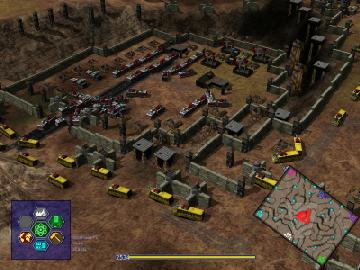

> **ARCHIVED**: This is an archive of an old map / mod from the old Addons site.

### [Map]

> [!IMPORTANT]
> This is an old map format. **Updated versions of maps are available in the Warzone 2100 Maps Database.**

# Rock Plain

| | |
| - | - |
| __Author:__ | Charca |
| Addon-type: | __Map__ |
| __Game Version:__ | 3.1.0 |
| Created: | April 28, 2013, 9:01 a.m. |
| Oil: | Low |
| Players: | 6 |
| Bases: | Normal bases |
| __License:__ | CC0-1.0 |

> File: [6cRockPlain.wz](https://github.com/Warzone2100/old-addons-site/raw/main/assets/169/6cRockPlain.wz)  
> SHA256: 498ddced98dfa61cfa2bbf8c5e22f6cc00707c68d2ec69eb26b50fd3a02e37a9

## Description:

A map with a lot of Scavenger units and mortar pits.Designed for 6 players.

