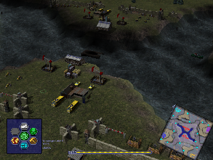

> **ARCHIVED**: This is an archive of an old map / mod from the old Addons site.

### [Map]

> [!IMPORTANT]
> This is an old map format. **Updated versions of maps are available in the Warzone 2100 Maps Database.**

# Scavenger Lake

| | |
| - | - |
| __Author:__ | Charca |
| Addon-type: | __Map__ |
| __Game Version:__ | 3.1.0 |
| Created: | Nov. 23, 2013, 1:20 a.m. |
| Oil: | Medium |
| Players: | 4 |
| Bases: | Normal bases |
| __License:__ | CC0-1.0 |

> File: [4cScavengerLake.wz](https://github.com/Warzone2100/old-addons-site/raw/main/assets/170/4cScavengerLake.wz)  
> SHA256: bcd1d249d112dea2dadb22a606724ecc0c86b90789beeed2bdf544daa6bbfebd

## Description:

A basic map with Scavenger naval units and 4 players.

