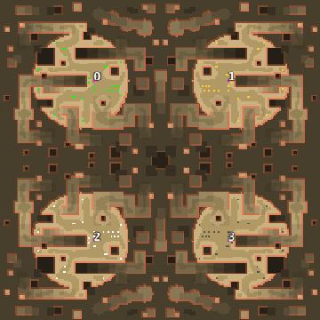

> **ARCHIVED**: This is an archive of an old map / mod from the old Addons site.

### [Map]

> [!IMPORTANT]
> This is an old map format. **Updated versions of maps are available in the Warzone 2100 Maps Database.**

# Mero_DeathZone

| | |
| - | - |
| __Author:__ | Merowingg |
| Addon-type: | __Map__ |
| __Game Version:__ | 3.1.0 |
| Created: | May 2, 2013, 6:35 p.m. |
| Oil: | Extreme |
| Players: | 4 |
| Bases: | Advanced Bases |
| __License:__ | CC-BY-SA-3.0 OR GPL-2.0-or-later |

> File: [4cMero_DeathZone.wz](https://github.com/Warzone2100/old-addons-site/raw/main/assets/172/4cMero_DeathZone.wz)  
> SHA256: 4880099e0d64be926f7ebc6118410a63c53e426914c05cdda274f14185aeb6f1

## Description:

Hello Gentlemen  

The map is called Death Zone because it is really hard to move around on it freely and without consequences  

The map is for four players, you have four trucks at the start, and believe me use them wisely  ten oils in base, but by that I mean on the top of the bases cliffs, because there is few more just next to you (practically in base) but the way to it is very long  or at least inconvenient  Generally the rest fifteen of oils is outside of the base, but here the inside/outside case is really difficult to explain due to the maps topography  It is advisable to check all "mysterious" places on the map  Advanced bases included  To sum up 25 oils per player  

The map is again with nice tilesets and the bases are full of features which are there to make them look appropriate  

On this map I started to play with the grounds levels and this is just the beginning  

Death Zone is real death zone so think all things through  

Have excellent fun  

Bye  

