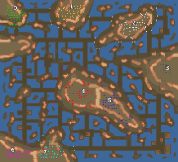

> **ARCHIVED**: This is an archive of an old map / mod from the old Addons site.

### [Map]

> [!IMPORTANT]
> This is an old map format. **Updated versions of maps are available in the Warzone 2100 Maps Database.**

# Mero_AsphaltSea

| | |
| - | - |
| __Author:__ | Merowingg |
| Addon-type: | __Map__ |
| __Game Version:__ | 3.1.0 |
| Created: | May 2, 2013, 6:39 p.m. |
| Oil: | Medium |
| Players: | 8 |
| Bases: | Advanced Bases |
| __License:__ | CC-BY-SA-3.0 OR GPL-2.0-or-later |

> File: [8cMero_AsphaltSea.wz](https://github.com/Warzone2100/old-addons-site/raw/main/assets/173/8cMero_AsphaltSea.wz)  
> SHA256: 1566bf6d23772a346362f452107eca5470ed13817a1f0c0a81557c5aa02b8525

## Description:

Hello Gentlemen  

The map is called Asphalt Sea because it is on the sea as you can see but it is extremely covered with industrial roads made of asphalt and side dirt roads. So the sea overcrowded with those roads changes from water sea into asphalt sea..  

It is my first asymetrical map since a very long time  I wanted to try few new things here  

The map is 200 x 220  for eight players  4 oils in base and another 5 per player outside the base  There is four trucks for each player but this time they are spread around each island area  Advanced bases included  including repair facility and eye candy features like laser or SAM AA  Inferno bunkers and rocket launchers towers  all in small reasonable amount  but always protective  

The map is overcrowded with nice terrain features as well as structures  you can find few port and industrial areas there  I wanted to expose the asphalt roads as nice as I could  There are many height levels and nice looking textures everywhere  

There is one Island without any base structures on the top left, but for equilibrium there is an empty port on the bottom right too  

I suggest that if it will be 4 v 4 game, players 0123 should compete with 5678, it sounds quite fair then. of course the choice belongs to you  This is an asymetrical map, and life is cruel  some places have advantages others not, some are better at something and worse at other thing  But I am sure all places have its potential  

Have fun Gentlemen  

I am waiting for opinions as always  

