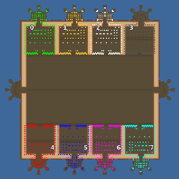

> **ARCHIVED**: This is an archive of an old map / mod from the old Addons site.

### [Map]

> [!IMPORTANT]
> This is an old map format. **Updated versions of maps are available in the Warzone 2100 Maps Database.**

# Mero_NTWClown

| | |
| - | - |
| __Author:__ | Merowingg |
| Addon-type: | __Map__ |
| __Game Version:__ | 3.1.0 |
| Created: | May 4, 2013, 6:13 p.m. |
| Oil: | Extreme |
| Players: | 8 |
| Bases: | Advanced Bases |
| __License:__ | CC-BY-SA-3.0 OR GPL-2.0-or-later |

> File: [8cMero_NTWClown.wz](https://github.com/Warzone2100/old-addons-site/raw/main/assets/175/8cMero_NTWClown.wz)  
> SHA256: c0526299c826ab9ceda1ed775c0cad956bfb38ccdca7c2b1c586cfaa466e9810

## Description:

Hello Gentlemen  

Some time ago I made few NTW maps  each of it was different and represented a different member of my NTW court  

There was the queen, the king, the wizard and even prince  now it is time for someone with no royal blood but still irreplaceable on the royal court  

It is the clown  because a good court has its clown to make them happy in hard times or simply to entertain the royal family  and court members  

The map is called Clown not without a reason  look carefully do you see those islands behind bases  and those two exactly in the middle of the map  those are the hats of our clown  each of it has three sparks  to explain what I mean I add the picture  below the map picture  

Clown is very funny  and he decided to make joke to all players  he put almost all of the oil behind the bases in difficult to protect places  He knows you like to turtle.. so try to turtle now  with almost all oil behind the base in fragile place the rules change a little bit  there is of course second entrance to each base at the back  

The map is 200 x 200  for eight players  4 oils in base  and 26 "behind" each base  in highly difficult to protect place  advanced bases included  

The map has a lot of nice tilesets  it is the clown who is supposed to be colorful and such is his map  

Around the arena there is one tile shore  smart players will know how to use it wisely  the hats have also enough space to built appropriate defences  both on the hat and its sparks too  so use them wisely  also the hats in the middle of the map at its edges can be great advantage if used wisely  

I think the map is quite nice  

Have fun Gentlemen  

