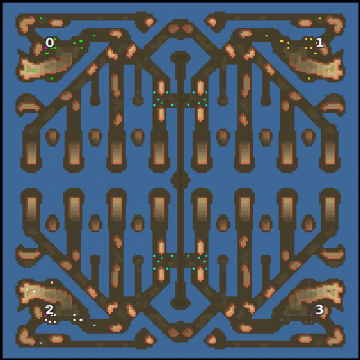

> **ARCHIVED**: This is an archive of an old map / mod from the old Addons site.

### [Map]

> [!IMPORTANT]
> This is an old map format. **Updated versions of maps are available in the Warzone 2100 Maps Database.**

# Mero_WaterJaws

| | |
| - | - |
| __Author:__ | Merowingg |
| Addon-type: | __Map__ |
| __Game Version:__ | 3.1.0 |
| Created: | May 4, 2013, 6:17 p.m. |
| Oil: | High |
| Players: | 4 |
| Bases: | Normal bases |
| __License:__ | CC-BY-SA-3.0 OR GPL-2.0-or-later |

> File: [4cMero_WaterJaws.wz](https://github.com/Warzone2100/old-addons-site/raw/main/assets/176/4cMero_WaterJaws.wz)  
> SHA256: 17bc815297e299038670c7dc8818cc52bbeff52964f99a41c113609de27cf259

## Description:

Hello Gentlemen  

After almost four months of not making maps which was for me like years.. I have finally get back on the track and I have created a new map  

I am very happy to do so  and like I said I will be back and I am  

The map is called Water Jaws because at least for me the ground on it looks a little like very big jaws on the water  

The map is for 4 players  the size is 200 x 200, it is seventeen oil per player, 2/3/4 oil in base according to what do you mean by in base  scavengers available  and advanced bases as well  

The map seems to be mainly the hover one but a long bridge allows ground units to go to the opponents, also the claws of the jaws allow ground units to protect them. When the scavengers are on, the bridge passage is a little bit more complicated to obtain  so the scavengers we can say change the game style into hover almost entirely but I might be wrong of course  

The claws are so design to enable players to protect at least to some point the water passages between them  

Have fun Gentlemen  

It is good to be back  

Bye  

