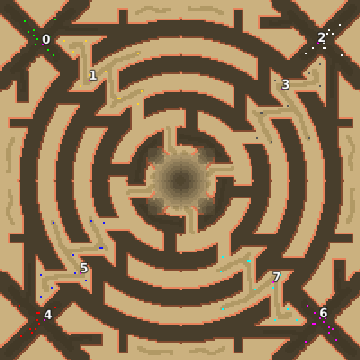

> **ARCHIVED**: This is an archive of an old map / mod from the old Addons site.

### [Map]

> [!IMPORTANT]
> This is an old map format. **Updated versions of maps are available in the Warzone 2100 Maps Database.**

# Mero_Tornado

| | |
| - | - |
| __Author:__ | Merowingg |
| Addon-type: | __Map__ |
| __Game Version:__ | 3.1.0 |
| Created: | May 4, 2013, 6:20 p.m. |
| Oil: | High |
| Players: | 8 |
| Bases: | Normal bases |
| __License:__ | CC-BY-SA-3.0 OR GPL-2.0-or-later |

> File: [8cMero_Tornado.wz](https://github.com/Warzone2100/old-addons-site/raw/main/assets/177/8cMero_Tornado.wz)  
> SHA256: 4c214919a6932f956550d45d87d49b2f553a62d1bb42408bc0a54761bb4e5906

## Description:

Hello Gentlemen  

I wanted to make a small experiment by making this map  

The map is called Tornado because it looks a little bit like tornado seen from birds view  

The map is so designed that it can be played 2 v 2 v 2 v 2 and also top versus bottom and.. here innovation.. top of the cliffs which is bases 1, 3, 5, 7 versus 0, 2, 4, 6 valley bases  also other combinations are possible  

Especially when it is 2 v 2 v 2 v 2 or top of the map versus bottom it is important to cooperate between the players on the cliffs and in the valleys  

The map is a little bit a labyrinth too  

It is 200 x 200, 4 oils in base and another 11 on the map per player  the map is for 8 players  advanced bases included  

Cooperation is crucial here  

Bye  

Have fun  

