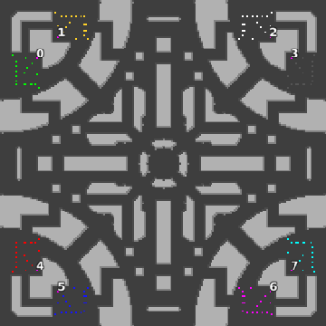

> **ARCHIVED**: This is an archive of an old map / mod from the old Addons site.

### [Map]

> [!IMPORTANT]
> This is an old map format. **Updated versions of maps are available in the Warzone 2100 Maps Database.**

# Mero_BlackCat

| | |
| - | - |
| __Author:__ | Merowingg |
| Addon-type: | __Map__ |
| __Game Version:__ | 3.1.0 |
| Created: | May 4, 2013, 6:23 p.m. |
| Oil: | High |
| Players: | 8 |
| Bases: | Advanced Bases |
| __License:__ | CC-BY-SA-3.0 OR GPL-2.0-or-later |

> File: [8cMero_BlackCat.wz](https://github.com/Warzone2100/old-addons-site/raw/main/assets/178/8cMero_BlackCat.wz)  
> SHA256: 4b675683f10b08c49c05bb313d6fa17b4630f0efe382cab9b04a4ba27949be38

## Description:

Hello Gentlemen  

After a longer time finally an Urban map  

As you well know I like to experiment and try new things  at least new for me  

At first the map preview shows nothing extremely extraordinary.. it is only when you play you will notice it is entirely consisting of black tiles  and also tiles that uses "corners" and "lines" with black tiles  I have no idea how to explain what I mean here  you have to see yourself  

The blackness gives cool effect  and those lines shaped by me into squares and rectangles  gives even cooler effect  

It was already compared to Tron world by my friend  and indeed it looks like the one from the movie a little bit  

Really eye pleasant it is although so dark  

The map is 200 x 200  what a surprise  for 8 players  4 oils in base  and another 11 per player on the map  advanced bases included  

i tried to make the map as interesting in terrain obstacles as possible  

It is great for 2 v 2 v 2 v2 and 4 v 4  I am not sure if FFA will work here as every pair of bases is close to each other..

Have fun  

And visit all dark corners to find all the oil  

Bye  

